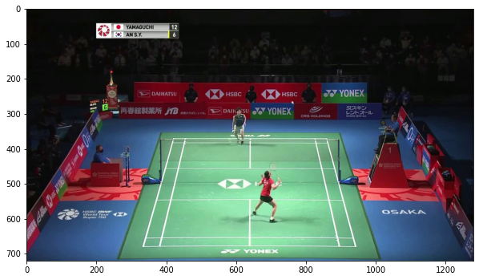
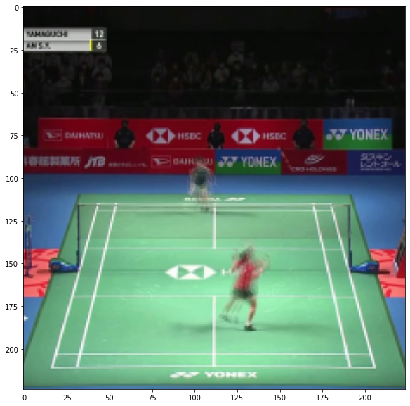
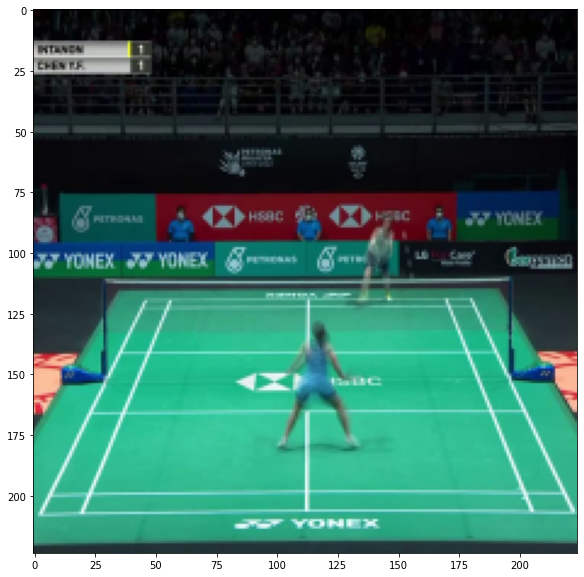
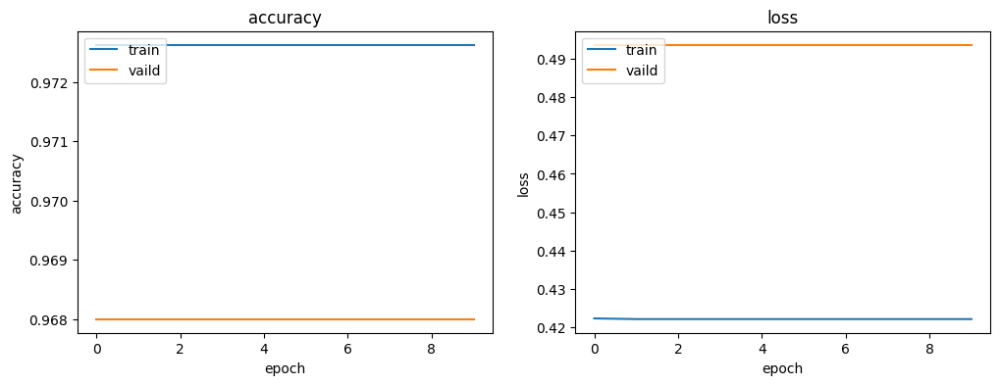

# Frame Detection

判斷球員在影片的第幾個 Frame 進行擊球

## Crop

原始資料是 1280x720 的影片，但其實球員移動的範圍只在影片中間的區塊，因此我將影片裁切成 720x720 的正方形，並且將擷取出來的逐格影像再縮小至 224x224

裁減前



裁剪後


## MixUp

由於影片的取樣頻率太高，每個 Frame 之間的動作差異不大，可能會無端增加模型負擔，所以我嘗試使用 MixUp 來壓縮資料，MixUp 是藉由將 2 個以上的 Frame 進行混合，產生新的 Frame

官方容許 2 個 Frame 的誤差，因此我的 MixUp 設定為 5 個 Frame（左右各 2 個誤差容許 Frame），以下是 MixUp 的結果，可以看到球員的動作產生殘影，表示他們的移動軌跡





## Oversampling

由於擊球的 Frame 數量遠少於非擊球的 Frame 數量，因此我使用 Oversampling 來增加擊球的 Frame 數量，對有擊球的資料組重複取樣，使它們的數量相近

## ConvLSTM2D

由於擊球是一系列動作的結果，因此我認為可以使用 RNN 模型來處理

這裡我將 8 個連續的 Frame 視為 1 組序列，並嘗試使用 Keras 的 ConvLSTM2D Layer 作為主要架構來訓練模型，模型是採用 Many 2 Many 架構，所以輸入的 8 個 Frame 都會產生是否擊球的預測機率

備註：從原始影片取樣的時候是以 1 個 Frame 為單位移動，也就是會得到 1~8、2~9、3~10 這樣的序列，目標是希望增加訓練資料量

```python
model = tf.keras.models.Sequential([
    tf.keras.layers.ConvLSTM2D(filters=64, kernel_size=(3, 3), input_shape=(None, *input_shape), padding='same', return_sequences=True),
    tf.keras.layers.BatchNormalization(),
    tf.keras.layers.ConvLSTM2D(filters=64, kernel_size=(3, 3), padding='same', return_sequences=True),
    tf.keras.layers.BatchNormalization(),
    tf.keras.layers.TimeDistributed(tf.keras.layers.Flatten()),
    tf.keras.layers.TimeDistributed(tf.keras.layers.Dense(64, activation='relu')),
    tf.keras.layers.TimeDistributed(tf.keras.layers.Dropout(dropout_rate)),
    tf.keras.layers.TimeDistributed(tf.keras.layers.Dense(1, activation='sigmoid'))
])
```

## Result

訓練結果如下圖所示，可以發現模型無法有效訓練，必須轉換方法


