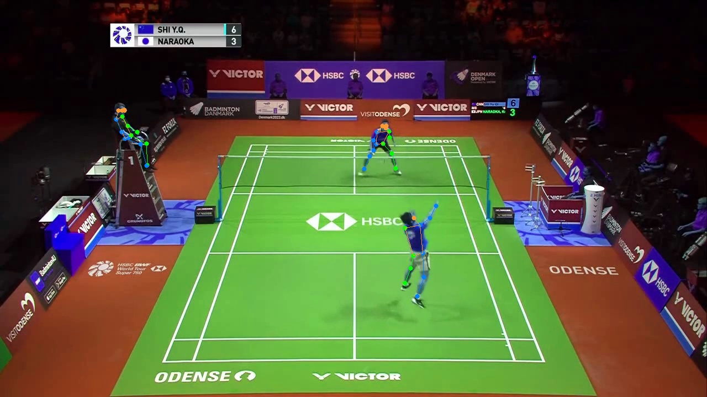
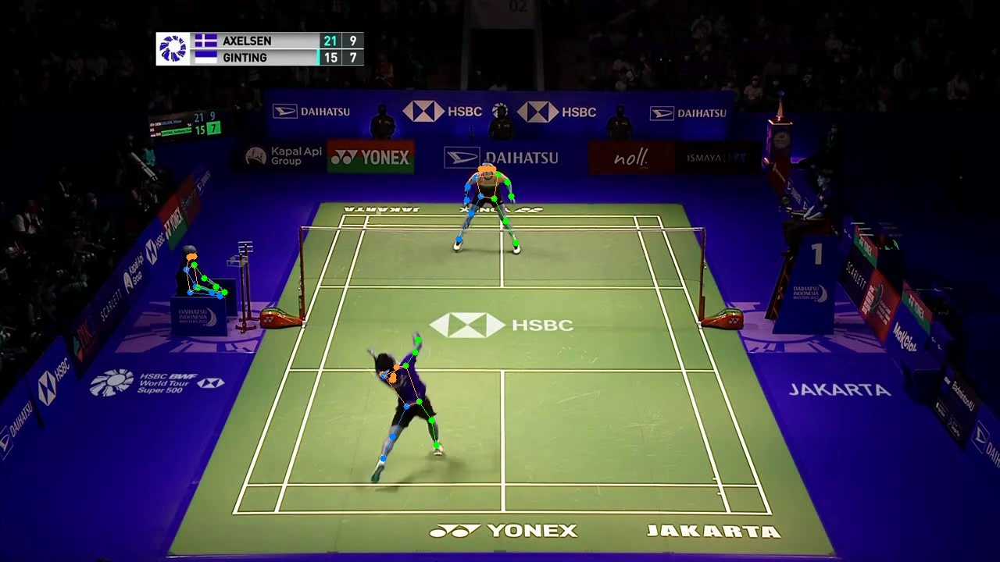
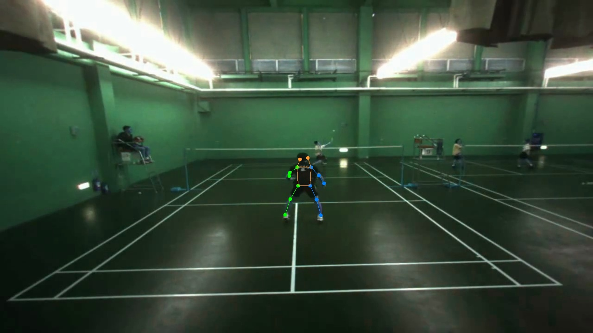

# Pose Estimation

假設已經能夠正確預測擊球拍數，再來需要判斷擊球座標，而判斷擊球座標的前提是判斷持拍位置

這裡嘗試使用 [MMPose](https://github.com/open-mmlab/mmpose) 進行人體軀幹偵測，實驗結果如下

1. 俯視角影像

    參考下面 2 張軀幹偵測的結果圖，可以發現在俯視角的情況下，可以準確偵測出人體軀幹的位置

   

   

2. 後視角影像

    參考下面的軀幹偵測結果圖，可以發現在後視角的情況下，雖然可以偵測出靠近攝影機的人體軀幹，但是對面的人體軀幹則無法偵測出來

   
